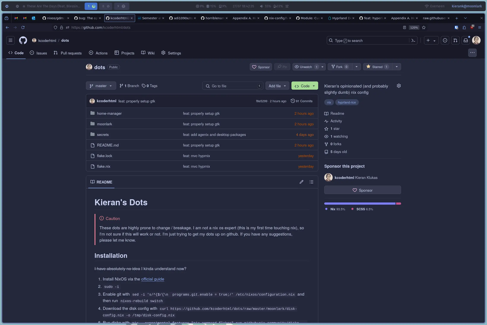
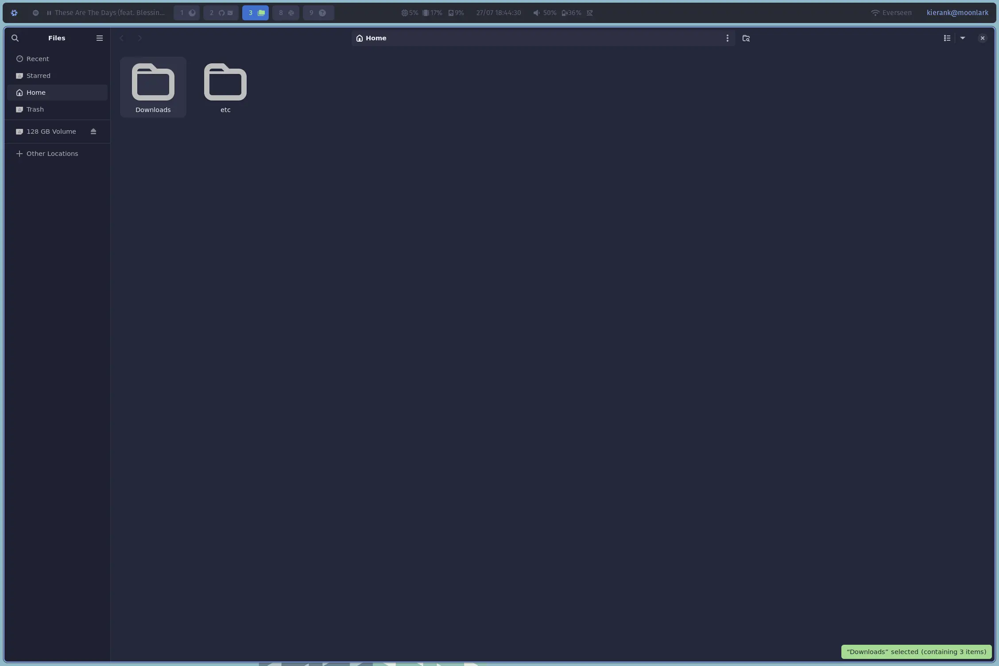
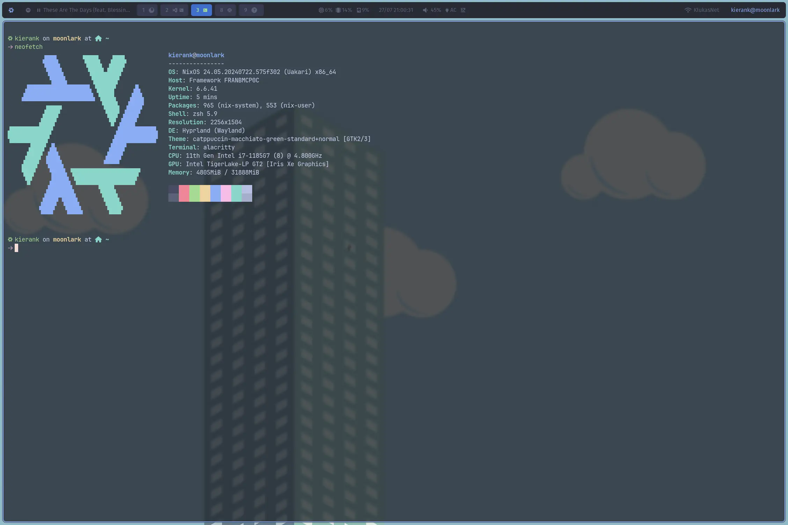
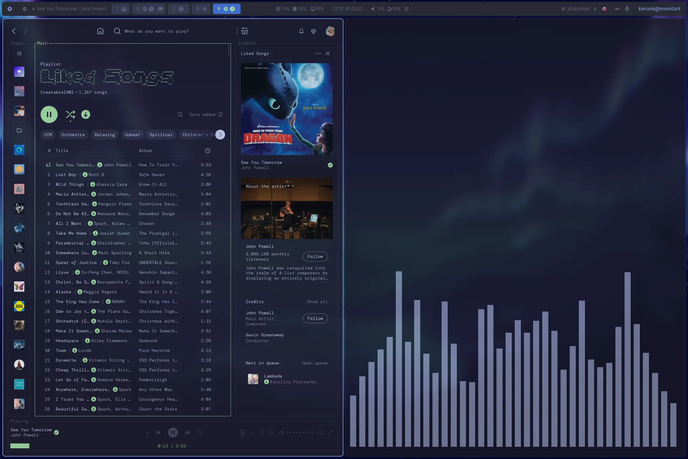
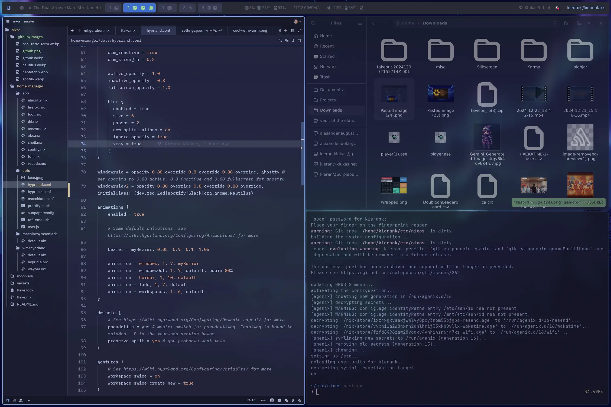
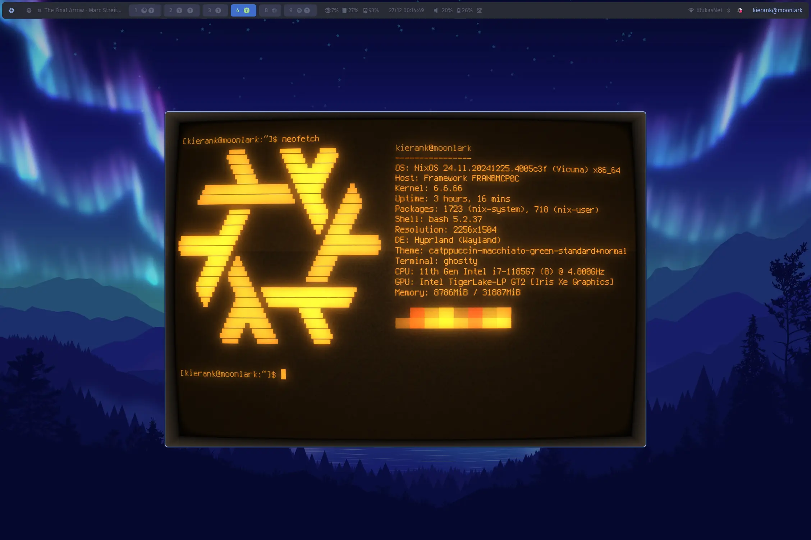

# Kieran's Dots


> [!CAUTION]
> These dots are highly prone to change / breakage.
>
> ~I am not a nix os expert (this is my first time touching nix), so I'm not sure if this will work or not. I'm just trying to get my dots up on github.~
>
> After `284` successful days of these dots being in constant operation, many many rebuilds, and `364` commits these dots have been rock solid and I have no complaints.

## The layout

```bash
~/dots # symlinked to /etc/nixos
├── dots # any config files that need to be symlinked go here, e.g. my hyprland config
│   └── wallpapers
├── machines
│   ├── atalanta # my macOS M4 machine
│   ├── ember # my dell r210 server (in my basement)
│   ├── john # shared server for cedarville
│   ├── moonlark # my framework 13 <dead>
│   ├── nest # shared tilde server through hc
│   ├── prattle # oracle cloud x86_64 server
│   ├── tacyon # rpi 5
│   └── terebithia # oracle cloud aarch64 server
├── modules
│   ├── home # home-manager modules
│   │   ├── aesthetics # theming and wallpapers
│   │   ├── apps # any app specific config
│   │   │   └── crush # vendored for now
│   │   ├── system # home-manager system configs
│   │   └── wm # window managers; just hyprland for now
│   │       └── hyprland
│   └── nixos # nixos modules
│       ├── apps # also app specific configs
│       └── system # pam and my fancy wifi module for now
└── secrets # keep your grubby hands (or paws) off my data

16 directories
```

## Installation

> [!WARNING]
> Also to note that this configuration will **not** work if you do not change any of the [secrets](./secrets) since they are encrypted.

You could either install a NixOS machine (rn there is just `moonlark`), use the home-manager instructions, or use nix-darwin for macOS.

### macOS with nix-darwin

For macOS machines, you can use nix-darwin:

1. Install Nix using the determinate systems installer:

```bash
curl -fsSL https://install.determinate.systems/nix | sh -s -- install
```

2. Clone the repository:

```bash
git clone git@github.com:taciturnaxolotl/dots.git
cd dots
```

3. Apply the configuration:

```bash
darwin-rebuild switch --flake .#atalanta
```

### Home Manager

Install nix via the determinate systems installer

```bash
curl -fsSL https://install.determinate.systems/nix | sh -s -- install --determinate
```

then copy ssh keys and chmod them

```bash
scp .ssh/id_rsa* nest:/home/kierank/.ssh/
ssh nest chmod 600 ~/.ssh/id_rsa*
```

and then clone the repo

```bash
git clone git@github.com:taciturnaxolotl/dots.git
cd dots
```

and execute the machine profile

```bash
nix-shell -p home-manager
home-manager switch --flake .#nest
```

setup atuin and import previous shell history

```bash
atuin login
atuin import
```

### NixOS

> These instructions have been validated by installing on my friend's machine ([`Nat2-Dev/dots`](https://github.com/Nat2-Dev/dots))

#### Using nixos-anywhere (Recommended for remote installations)

> [!INFO]
> This only currently works with `prattle` and `terebithia` as they have the proper disko configs setup.

For remote installations (like Oracle Cloud), use [nixos-anywhere](https://github.com/nix-community/nixos-anywhere):

```bash
nix run github:nix-community/nixos-anywhere -- \
  --flake .#prattle \
  --generate-hardware-config nixos-facter ./machines/prattle/facter.json \
  --build-on-remote \
  root@<ip-address>
```

Replace `prattle` with your machine configuration and `<ip-address>` with your target machine's IP.

> **Note**: Make sure your SSH key is in the target machine's `authorized_keys` and the machine configuration has the correct network settings. The `--generate-hardware-config nixos-facter` flag will generate a comprehensive hardware report using [nixos-facter](https://github.com/numtide/nixos-facter) instead of the traditional `nixos-generate-config`.

#### Using the install script

```bash
curl -L https://raw.githubusercontent.com/taciturnaxolotl/dots/main/install.sh -o install.sh
chmod +x install.sh
./install.sh
```

#### The manual way

Install NixOS via the [official guide](https://nixos.org/download.html)

Connect to wifi

```bash
wpa_passphrase your-ESSID your-passphrase | sudo tee /etc/wpa_supplicant.conf
sudo systemctl restart wpa_supplicant
```

Check with `ping 1.1.1.1` if that doesn't work then use `wpa_cli`

```bash
sudo systemctl start wpa_supplicant
wpa_cli

add_network 0

set_network 0 ssid "put your ssid here"

set_network 0 psk "put your password here"

enable network 0

exit
```

Aquire root permissions while keeping your current context with

```bash
sudo -i
```

Enable git and rebuild your flake with the following

```bash
sed -i 's/^{$/{\n  programs.git.enable = true;/' /etc/nixos/configuration.nix
nixos-rebuild switch
```

Download the disk configuration and run it

```bash
curl -L https://github.com/taciturnaxolotl/dots/raw/main/moonlark/disk-config.nix -o /tmp/disk-config.nix
nix --experimental-features "nix-command flakes" run github:nix-community/disko -- --mode destroy,format,mount /tmp/disk-config.nix
```

Run nixos generate config and cd into it

```bash
nixos-generate-config --root /mnt
cd /mnt/etc/nixos
```

Clone this repo to your `/mnt/etc/nixos` folder

```bash
rm *
git clone https://github.com/taciturnaxolotl/dots.git .
```

Add your ssh private key to `/mnt/etc/ssh/id_rsa`

install the flake, and umount the filesystem, and then reboot

```bash
nixos-install --flake .#moonlark --no-root-passwd
reboot
```

Pray to the nix gods that it works 🙏

If it worked then you should be able to login with the user `kierank` and the password `lolzthisaintsecure!`

You should immediately change the password

```bash
passwd kierank
```

Move the config to your local directory, link to `/etc/nixos`, and change permissions

```bash
sudo mv /etc/nixos ~/dots
sudo ln -s ~/dots /etc/nixos
sudo chown -R $(id -un):users ~/dots
sudo chown kierank -R ~/dots
sudo chown kierank -R ~/dots/.*
```

17. Setup the fingerprint reader and verify it works (you may need to swipe your finger across the fingerprint sensor instead of simply laying it there)

```bash
sudo fprintd-enroll -f right-index-finger kierank
sudo fprintd-verify kierank
```

Finally enable [atuin](https://atuin.sh/)

```bash
atuin login
atuin sync
```

## some odd things

for helix if you want the grammar to work you must run the following as per [this helix discussion](https://github.com/helix-editor/helix/discussions/10035#discussioncomment-13852637)

```bash
hx -g fetch
hx -g build
```

## Screenshots

<details>
    <summary>I've stuck the rest of the screenshots in a spoiler to preserve space</summary>
<br/>

**Last updated: 2024-12-27**








</details>

## Credits

Thanks a bunch to the following people for their dots, configs, and general inspiration which i've shamelessly stolen from:

- [NixOS/nixos-hardware](https://github.com/NixOS/nixos-hardware)
- [hyprland-community/hyprnix](https://github.com/hyprland-community/hyprnix)
- [spikespaz/dotfiles](https://github.com/spikespaz/dotfiles)
- [Misterio77/nix-starter-configs](https://github.com/Misterio77/nix-starter-configs)
- [mccd.space install guide](https://mccd.space/posts/git-to-deploy/)
- [disco docs](https://github.com/nix-community/disko/blob/master/docs/quickstart.md)
- [XDG_CONFIG_HOME setting](https://github.com/NixOS/nixpkgs/issues/224525)
- [Daru-san/spicetify-nix](https://github.com/Daru-san/spicetify-nix)
- [agenix](https://nixos.wiki/wiki/Agenix)
- [wpa_supplicant env file docs](https://search.nixos.org/options?show=networking.wireless.environmentFile&from=0&size=50&sort=relevance&type=packages&query=networking.wireless)
- [escaping nix variables](https://www.reddit.com/r/NixOS/comments/jmlohf/escaping_interpolation_in_bash_string/)
- [nerd fonts cheat sheet](https://www.nerdfonts.com/cheat-sheet)
- [setting the default shell in nix](https://www.reddit.com/r/NixOS/comments/z16mt8/cant_seem_to_set_default_shell_using_homemanager/)
- [hyprwm/contrib](https://github.com/hyprwm/contrib)
- [gtk with home manager](https://hoverbear.org/blog/declarative-gnome-configuration-in-nixos/)
- [setting up the proper portals](https://github.com/NixOS/nixpkgs/issues/274554)
- [tuigreet setup](https://github.com/sjcobb2022/nixos-config/blob/29077cee1fc82c5296908f0594e28276dacbe0b0/hosts/common/optional/greetd.nix)

## 📜 License

The code is licensed under `MIT`! That means MIT allows for free use, modification, and distribution of the software, requiring only that the original copyright notice and disclaimer are included in copies. All artwork and images are copyright reserved but may be used with proper attribution to the authors.

<p align="center">
        
</p>

<p align="center">
        <i><code>&copy 2025-present <a href="https://github.com/taciturnaxolotl">Kieran Klukas</a></code></i>
</p>

<p align="center">
        <a href="https://github.com/taciturnaxolotl/dots/blob/master/LICENSE.md"></a>
</p>
