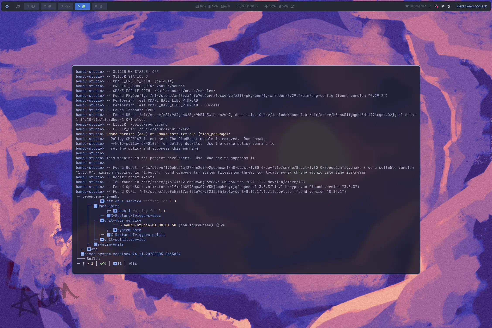
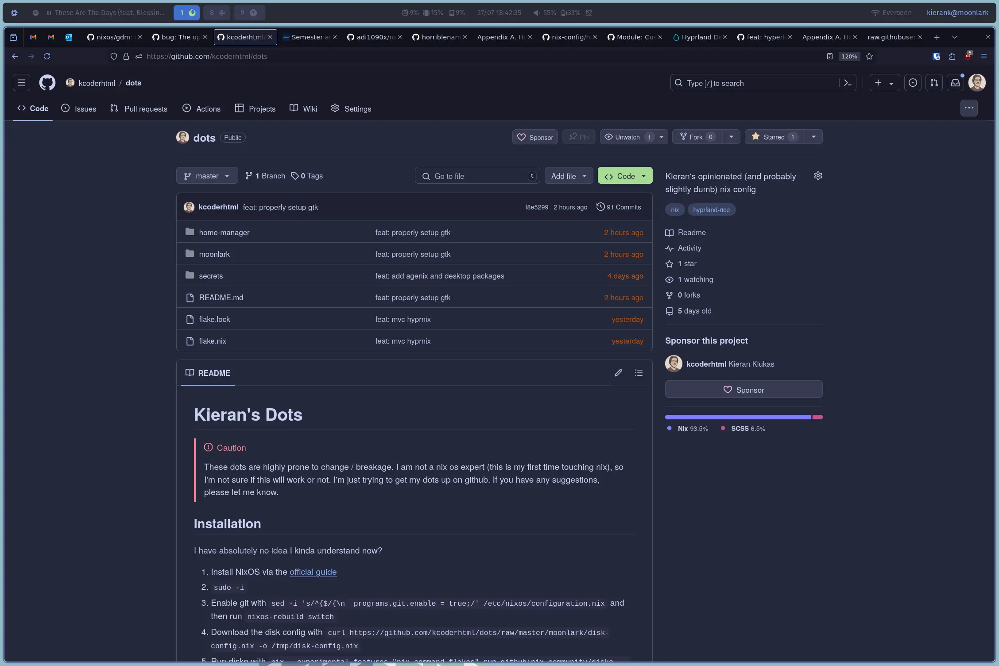
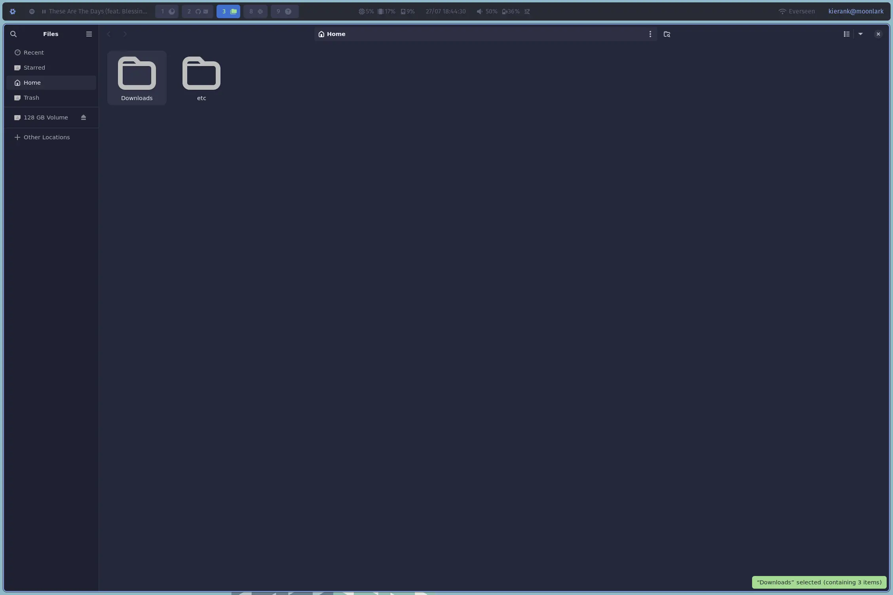
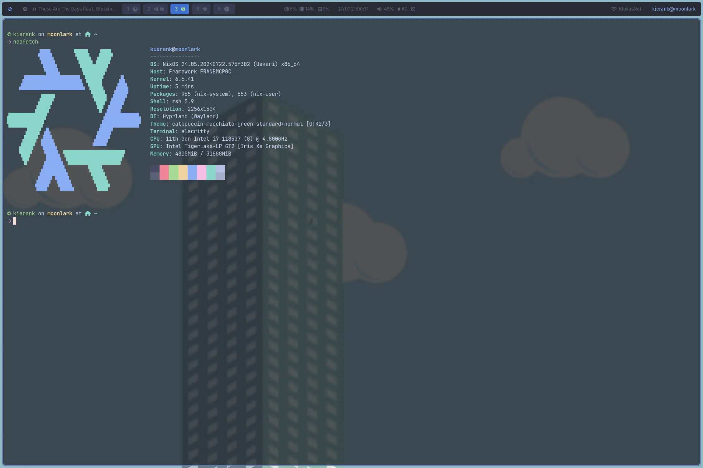
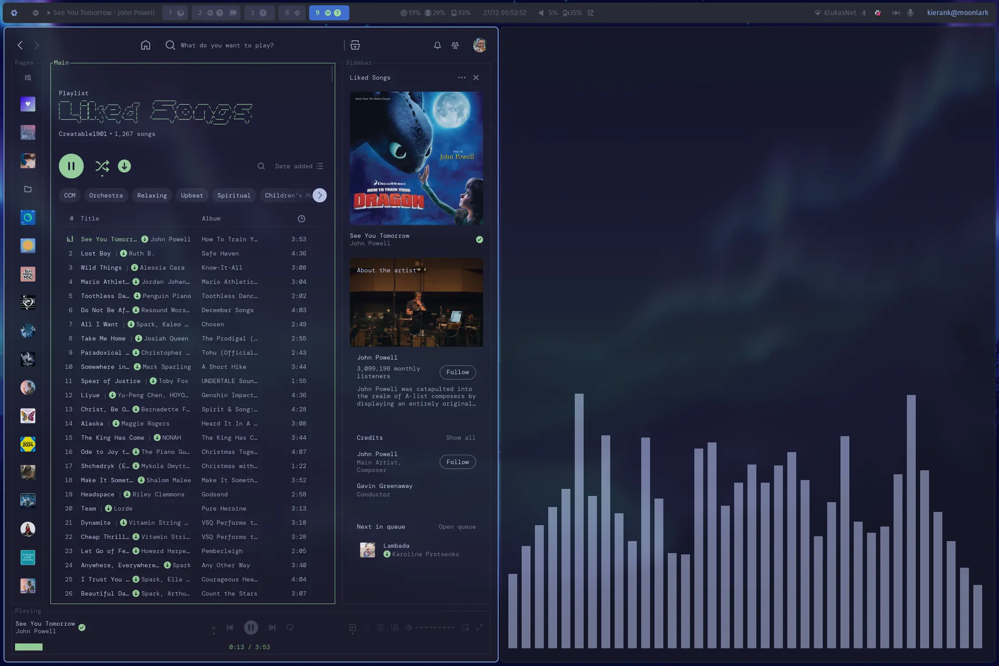
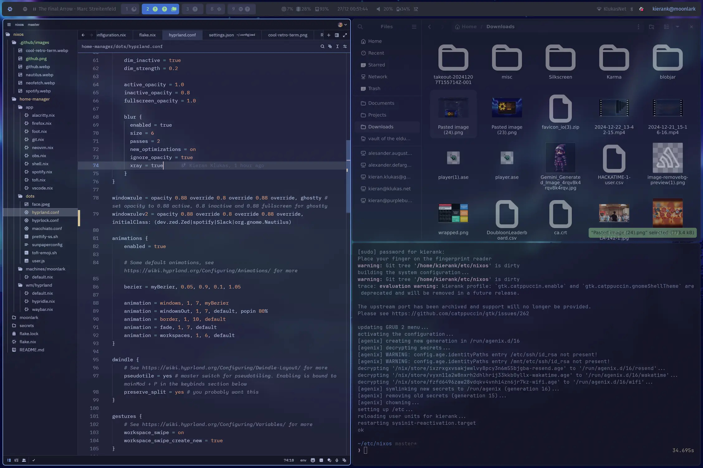
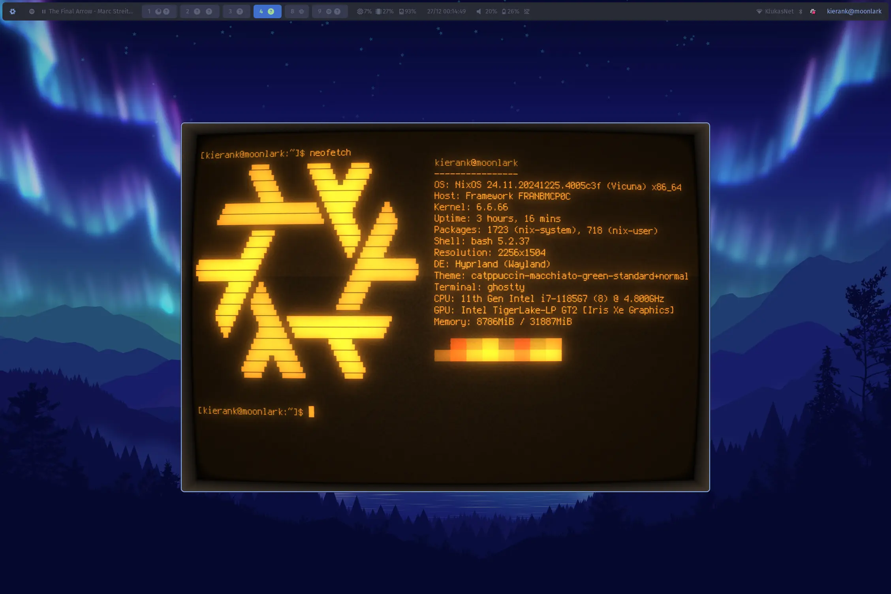

# Kieran's Dots



> [!CAUTION]
> These dots are highly prone to change / breakage.
>
> ~~I am not a nix os expert (this is my first time touching nix), so I'm not sure if this will work or not. I'm just trying to get my dots up on github.~~
>
> After `591` days of these dots being in constant operation, many many rebuilds, and `776` commits these dots have been rock solid and I have no complaints.

## The layout

```
~/dots
├── .github/workflows  # CI/CD (deploy-rs + per-service reusable workflow)
├── dots               # config files symlinked by home-manager
│   └── wallpapers
├── machines
│   ├── atalanta       # macOS M4 (nix-darwin)
│   ├── ember          # dell r210 server (basement)
│   ├── moonlark       # framework 13 (dead)
│   ├── nest           # shared tilde server (home-manager only)
│   ├── prattle        # oracle cloud x86_64
│   ├── tacyon         # rpi 5
│   └── terebithia     # oracle cloud aarch64 (main server)
├── modules
│   ├── lib
│   │   └── mkService.nix  # service factory (see Deployment section)
│   ├── home           # home-manager modules
│   │   ├── aesthetics # theming and wallpapers
│   │   ├── apps       # app configs (ghostty, helix, git, ssh, etc.)
│   │   ├── system     # shell, environment
│   │   └── wm/hyprland
│   └── nixos          # nixos modules
│       ├── apps       # system-level app configs
│       ├── services   # self-hosted services (mkService-based + custom)
│       │   ├── restic # backup system with CLI
│       │   └── bore   # tunnel proxy
│       └── system     # pam, wifi
├── packages           # custom nix packages
└── secrets            # agenix-encrypted secrets
```

## Installation

> [!WARNING]
> Also to note that this configuration will **not** work if you do not change any of the [secrets](./secrets) since they are encrypted.

You could install a NixOS machine, use the home-manager instructions, or use nix-darwin for macOS.

### macOS with nix-darwin

For macOS machines, you can use nix-darwin:

1. Install Nix using the determinate systems installer:

```bash
curl -fsSL https://install.determinate.systems/nix | sh -s -- install
```

2. Clone the repository:

```bash
git clone git@github.com:taciturnaxolotl/dots.git
cd dots
```

3. Apply the configuration:

```bash
darwin-rebuild switch --flake .#atalanta
```

### Home Manager

Install nix via the determinate systems installer

```bash
curl -fsSL https://install.determinate.systems/nix | sh -s -- install --determinate
```

then copy ssh keys and chmod them

```bash
scp .ssh/id_rsa* nest:/home/kierank/.ssh/
ssh nest chmod 600 ~/.ssh/id_rsa*
```

and then clone the repo

```bash
git clone git@github.com:taciturnaxolotl/dots.git
cd dots
```

and execute the machine profile

```bash
nix-shell -p home-manager
home-manager switch --flake .#nest
```

setup atuin and import previous shell history

```bash
atuin login
atuin import
```

### NixOS

> These instructions have been validated by installing on my friend's machine ([`Nat2-Dev/dots`](https://github.com/Nat2-Dev/dots))

#### Using nixos-anywhere (Recommended for remote installations)

> [!WARNING]
> This only currently works with `prattle` and `terebithia` as they have the proper disko configs setup.

For remote installations (like Oracle Cloud), use [nixos-anywhere](https://github.com/nix-community/nixos-anywhere):

```bash
nix run github:nix-community/nixos-anywhere -- \
  --flake .#prattle \
  --generate-hardware-config nixos-facter ./machines/prattle/facter.json \
  --build-on-remote \
  root@<ip-address>
```

Replace `prattle` with your machine configuration and `<ip-address>` with your target machine's IP.

> [!NOTE]
> Make sure your SSH key is in the target machine's `authorized_keys` and the machine configuration has the correct network settings. The `--generate-hardware-config nixos-facter` flag will generate a comprehensive hardware report using [nixos-facter](https://github.com/numtide/nixos-facter) instead of the traditional `nixos-generate-config`.

#### Using the install script

```bash
curl -L https://raw.githubusercontent.com/taciturnaxolotl/dots/main/install.sh -o install.sh
chmod +x install.sh
./install.sh
```

#### Post-install

After first boot, log in with user `kierank` and the default password, then change it immediately:

```bash
passwd kierank
```

Move the config to your home directory and symlink:

```bash
sudo mv /etc/nixos ~/dots
sudo ln -s ~/dots /etc/nixos
sudo chown -R $(id -un):users ~/dots
```

Set up [atuin](https://atuin.sh/) for shell history sync:

```bash
atuin login
atuin sync
```

## Deployment

Two deploy paths: **infrastructure** (NixOS config changes in this repo) and **application code** (per-service repos).

### Infrastructure

Pushing to `main` here triggers `.github/workflows/deploy.yaml` which runs `deploy-rs` over Tailscale to rebuild NixOS on the target machine.

```sh
# manual deploy
nix run 'github:serokell/deploy-rs' -- --remote-build --ssh-user kierank .
```

### Application code

Each service repo has a minimal workflow calling the reusable `.github/workflows/deploy-service.yml`. On push to `main`:

1. Connects to Tailscale (`tag:deploy`)
2. SSHes as the **service user** (e.g., `cachet@terebithia`) via Tailscale SSH
3. Snapshots the SQLite DB (if `db_path` is provided)
4. `git pull` + `bun install --frozen-lockfile` + `sudo systemctl restart`
5. Health check (HTTP URL or systemd status fallback)
6. Auto-rollback on failure (restores DB snapshot + reverts to previous commit)

Per-app workflow — copy and change the `with:` values:

```yaml
name: Deploy
on:
  push:
    branches: [main]
  workflow_dispatch:
jobs:
  deploy:
    uses: taciturnaxolotl/dots/.github/workflows/deploy-service.yml@main
    with:
      service: cachet
      health_url: https://cachet.dunkirk.sh/health
      db_path: /var/lib/cachet/data/cachet.db
    secrets:
      TS_OAUTH_CLIENT_ID: ${{ secrets.TS_OAUTH_CLIENT_ID }}
      TS_OAUTH_SECRET: ${{ secrets.TS_OAUTH_SECRET }}
```

Omit `health_url` to fall back to `systemctl is-active`. Omit `db_path` for stateless services.

### mkService

`modules/lib/mkService.nix` standardizes service modules. A call to `mkService { ... }` provides:

- Systemd service with initial git clone (subsequent deploys via GitHub Actions)
- Caddy reverse proxy with TLS via Cloudflare DNS and optional rate limiting
- Data declarations (`sqlite`, `postgres`, `files`) that feed into automatic backups
- Dedicated system user with sudo for restart/stop/start (enables per-user Tailscale ACLs)
- Port conflict detection, security hardening, agenix secrets

Adding a new service: create a module in `modules/nixos/services/`, enable it in `machines/terebithia/default.nix`, and add a deploy workflow to the app repo. See `modules/nixos/services/cachet.nix` for a minimal example.

### Secrets (agenix)

Secrets are encrypted in `secrets/*.age` and declared in `secrets/secrets.nix`. Referenced as `config.age.secrets.<name>.path` — decrypted at activation time to `/run/agenix/`.

```sh
cd secrets && agenix -e myapp.age    # create/edit a secret
```

## Backups

Services are automatically backed up nightly using restic to Backblaze B2. Backup targets are auto-discovered from `data.sqlite`/`data.postgres`/`data.files` declarations in mkService modules.

The `atelier-backup` CLI provides an interactive TUI for managing backups:

```bash
sudo atelier-backup              # Interactive menu
sudo atelier-backup status       # Show backup status
sudo atelier-backup restore      # Restore wizard
sudo atelier-backup dr           # Disaster recovery
```

See [modules/nixos/services/restic/README.md](modules/nixos/services/restic/README.md) for setup and usage.

## some odd things

for helix if you want the grammar to work you must run the following as per [this helix discussion](https://github.com/helix-editor/helix/discussions/10035#discussioncomment-13852637)

```bash
hx -g fetch
hx -g build
```

## Screenshots

<details>
    <summary>I've stuck the rest of the screenshots in a spoiler to preserve space</summary>
<br/>

**Last updated: 2024-12-27**








</details>

## Credits

Thanks a bunch to the following people for their dots, configs, and general inspiration which i've shamelessly stolen from:

- [NixOS/nixos-hardware](https://github.com/NixOS/nixos-hardware)
- [hyprland-community/hyprnix](https://github.com/hyprland-community/hyprnix)
- [spikespaz/dotfiles](https://github.com/spikespaz/dotfiles)
- [Misterio77/nix-starter-configs](https://github.com/Misterio77/nix-starter-configs)
- [mccd.space install guide](https://mccd.space/posts/git-to-deploy/)
- [disco docs](https://github.com/nix-community/disko/blob/master/docs/quickstart.md)
- [XDG_CONFIG_HOME setting](https://github.com/NixOS/nixpkgs/issues/224525)
- [Daru-san/spicetify-nix](https://github.com/Daru-san/spicetify-nix)
- [agenix](https://nixos.wiki/wiki/Agenix)
- [wpa_supplicant env file docs](https://search.nixos.org/options?show=networking.wireless.environmentFile&from=0&size=50&sort=relevance&type=packages&query=networking.wireless)
- [escaping nix variables](https://www.reddit.com/r/NixOS/comments/jmlohf/escaping_interpolation_in_bash_string/)
- [nerd fonts cheat sheet](https://www.nerdfonts.com/cheat-sheet)
- [setting the default shell in nix](https://www.reddit.com/r/NixOS/comments/z16mt8/cant_seem_to_set_default_shell_using_homemanager/)
- [hyprwm/contrib](https://github.com/hyprwm/contrib)
- [gtk with home manager](https://hoverbear.org/blog/declarative-gnome-configuration-in-nixos/)
- [setting up the proper portals](https://github.com/NixOS/nixpkgs/issues/274554)
- [tuigreet setup](https://github.com/sjcobb2022/nixos-config/blob/29077cee1fc82c5296908f0594e28276dacbe0b0/hosts/common/optional/greetd.nix)

## 📜 License

The code is licensed under `MIT`! That means MIT allows for free use, modification, and distribution of the software, requiring only that the original copyright notice and disclaimer are included in copies. All artwork and images are copyright reserved but may be used with proper attribution to the authors.

<p align="center">
        
</p>

<p align="center">
        <i><code>&copy 2025-present <a href="https://github.com/taciturnaxolotl">Kieran Klukas</a></code></i>
</p>

<p align="center">
        <a href="https://github.com/taciturnaxolotl/dots/blob/master/LICENSE.md"></a>
</p>
